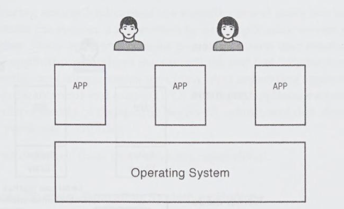
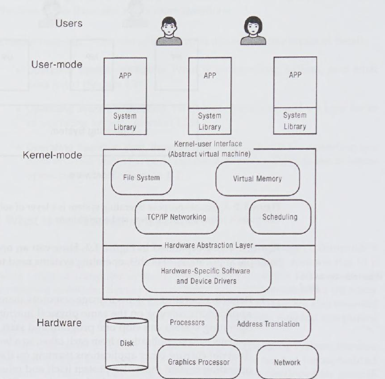
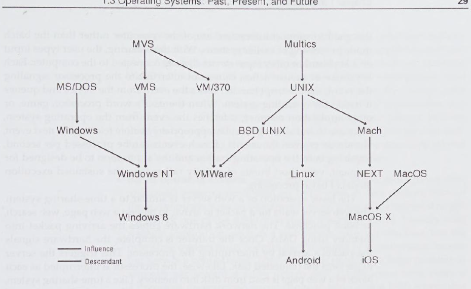

# introduccion 

un sistema operativo es la capa de software que se encarga de hacer de intermediario entre las aplicaciones y los recursos la pc, procesa y abstrae el hardware de bajo nivel proveyendo una interfaz para comunicarse con el mismo indirectamente, comparte la computadora entre multiples programas, es la capa de software que maneja los recursos de la computadora para el usuario y las aplicaciones

## referee

se encarga de mediar entre aplicaciones, puede parar una para iniciar otra, aisla las aplicaciones para que un error en una no se extienda a otra

## ilucionista

se encarga de que no tengas que preocuparte por el manejo de los recursos a la hora de crear o ejecutar un programa, el lo hace por vos

## pegamento

se encarga de enlazar las distintas piezas del sistemas

## compartir recursos

reparte los recursos de la pc entre los distintos programas 

### alocacion de recursos

se encarga de asignarle los recursos especificos para cada programa individual de manera simultanea

### aislamiento

el error de un programa no deberia poder voltear todo el sistema, para eso el sistema debe poder aislar las distintas piezas del mismo

### comunicacion

por contraparte, debe poder comunicar un programa con sus distintas dependencias y en su defecto con otros programas

## enmascarando limitaciones

el sistema debe poder darle la cantidad de memoria justa a cada programa y manejar correctamente las interrupciones de un programa de manera tal que no parezca que tanto la RAM como el cpu son limitados

## proveer servicios comunes

debe dar servicios en comun para todas las piezas de software que los requieran funcionando asi como pegamento 

## virtualizacion

agarra un recurso fisico y lo transforma en una forma virtual dandole a asi una interfaz comoda para poder enlazarla con los demas programas

## unix 

fue uno de los primeros sistemas operativos pensados con el opbjetivo de simplificar una interfaz y requisitos comunes para todo SO moderno

### simplicidad

cada programa debe hacer una unica tarea bien

### interoperabilidad 

la salida de un programa puede ser la entrada de otro

### pruebas tempranas

diseñar software para ser probado lo antes posible

### uso de herramientas para eficiencia

Utiliza herramientas especializadas para simplificar tareas de programación, incluso si implica construir herramientas temporales que se descarten después de su uso.

## kernel

el kernel es la capa de software intermedia que se encarga de comunicar a los programas de alto nivel con las distintas capas de software